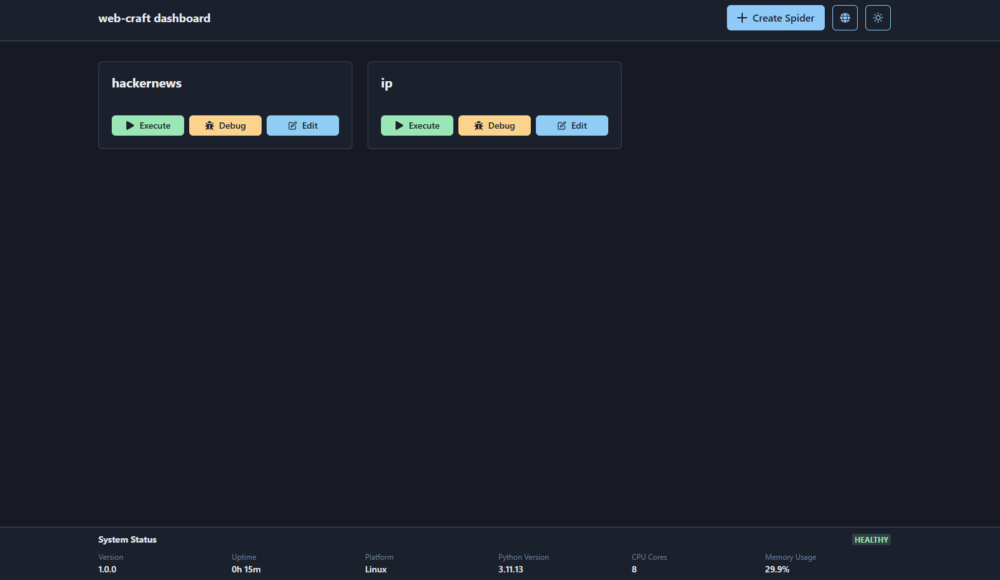

 # Web Craft Dashboard (Frontend)

Modern React + TypeScript interface for managing Web Craft spiders. This UI integrates Chakra UI components, code-editing support, theme/language toggles, and real-time system health data from the backend.



## ✨ Features

- **Spider Management**: Create, edit, delete, execute, and debug spiders with syntax-highlighted editors.
- **Live Results**: Execution/debug modals display structured data, status badges, and JSON payloads.
- **Health Monitor**: A fixed footer shows backend health, uptime, CPU/memory usage, and platform info.
- **Theming & i18n**: Light/dark theme switch plus instant language toggle (English/Chinese).
- **Chakra UI Layout**: Responsive cards, modals, grids, and alerts tailored for both desktop and mobile.

## 🧱 Tech Stack

- React 18 + TypeScript
- Chakra UI + React Icons
- Zustand for spider store
- Vite tooling
- ESLint + TypeScript strict mode

## 🚀 Getting Started

```bash
npm install       # install dependencies
npm run dev       # start dev server (default http://localhost:5173)
npm run lint      # run ESLint checks
npm run build     # bundle for production
npm run preview   # preview production build
```

## 🔌 Backend Requirements

- Backend API base URL defaults to `http://0.0.0.0:8080/api/v1`.
- Ensure the backend exposes `/spiders`, `/spiders/{name}`, `/spiders/{name}/code`, `/crawl/*`, and `/health` endpoints.

## 📁 Project Structure

```
src/
  components/SpiderList.tsx   # Main dashboard component
  services/api.ts             # API wrappers (spiders, crawl, health)
  store/useSpiderStore.ts     # Zustand store
  i18n/                       # Language context & translations
  theme.ts                    # Chakra theme overrides
  main.tsx                    # App entry with providers
```

## 🛠 Customization Tips

- Update `src/i18n/translations.ts` to add more languages.
- Modify `src/theme.ts` for brand colors, fonts, or component defaults.
- Extend `spiderApi` in `src/services/api.ts` for additional backend endpoints.

## 📄 License

This project is licensed under the **MIT License**.